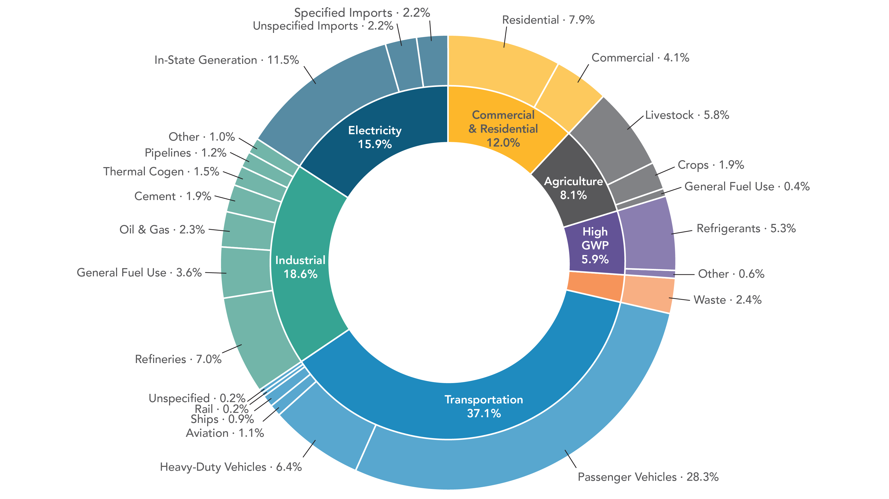

CARB’s AB 32 Climate Change Scoping Plan outlines a path for the state to reduce anthropogenic greenhouse gas (GHG) emissions by 85% below 1990 levels and achieve carbon neutrality by the year 2045. As part of this initiative, the California GHG Inventory compiles data related to statewide GHG emissions from anthropogenic sources.

The Scoping Plan categorizes emissions sources into seven different sectors, then divides these sectors into subcategories to further specify the source. The graphic above displays the GHG contributions made by each of these categories and subcategories.

**Limitations of the graphic and areas for improvement:**

Donut and pie charts overall are poor choices for data visualization due to the general difficulty people have in assessing and comparing angles and arclengths. In order to obtain useful information about the data in these types of graphics, one needs to read the labels and percentages, which defeats the purpose of having a visualization altogether. This issue is especially prominent among segments of similar sizes and becomes more pronounced as the number of segments increases. Not only this, but the circular nature of the information displayed makes the visualization inherently overwhelming, as there is no start or end point or clear direction for one’s eyes to follow.

Some noticeable issues specific to this graphic are:

-   It is difficult to get a precise idea of how much each sector contributed to California's GHG emissions and how they compare to each other without reading the percentages.

-   It is even more difficult to compare subcategories, especially across sectors.

-   The nested circles depict the information in a misleading way since any given percentage of the outer circle has a greater area than the same percentage of the inner circle. For example, the subcategory “in-state generation” under Electricity appears to larger than the entire Commercial & Residential sector.

-   One of the sectors is not labeled.
