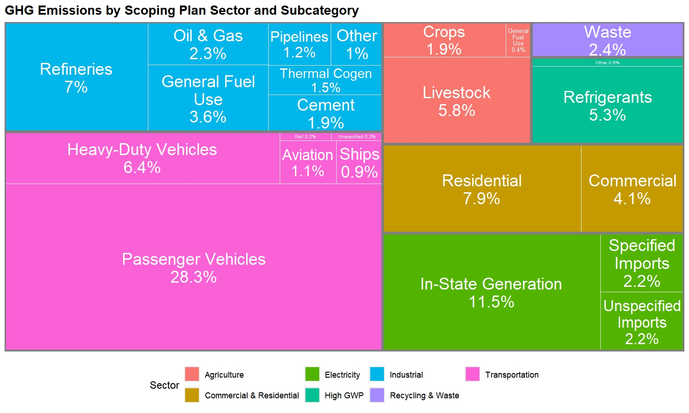

# Redesign #1

{width="1500"}

This is a horizontal bar graph of GHG emissions by Scoping Plan subcategory, organized in order of percent contribution and color-coded by sector.

This redesign organizes the information on the original graphic in a way that is more useful makes comparisons between subcategories easier and presents the information in a more visually organized manner than the original graphic. It is immediately clear when looking at this graph what the largest and smallest sources of emissions are and how the other subcategories rank between them. This design also allows better comparisons between sectors. For example, it is easy to see that “Passenger Vehicles,” a subcategory of Transportation, accounts for the highest percentage of emissions, followed by “In-State Generation,” a subcategory of Electricity. This information gives insight into the most efficient allocation of resources to reduce GHG emissions.

# Redesign #2

This is a stacked bar plot of GHG emissions by each of the sectors outlined in the Scoping Plan. Each bar is segmented into the subcategories of that sector and stacked in order of percent.

This side-by-side presentation of the sectors and subcategories makes the data easier to interpret and compare than the original circular design. It is clear how each of the sectors compare to one another in their GHG productions, and one can also glean more information about the impact each of the subcategories has on total emissions. For example, it is immediately apparent from this visualization that “Passenger Vehicles” alone, one subcategory of Transportation, produces more GHG emissions than the entirety of any other sector, and even more than some of the sectors combined. This kind of information is critical in determining the best sources to target in efforts to reduce GHG emissions.

# Redesign #3

# 

This is a treemap which segments a rectangle first by sector and then further by subcategory. The sizes of these nested rectangles are proportional to the percentage of GHG emissions produced by that sector/subcategory.

Similarly to the original graphic, each sector is broken down into its subcategories, color-coded, and kept together as a unit. However, the rectangular box design as opposed to the circular donut design presents the data in a less overwhelming manner since all the information appears on a single “sheet” rather than requiring one’s eyes to go around in circles. Moreover, differences in areas of rectangles are more discernable than differences in arclengths of donut pieces, making comparisons between and across sectors easier.

**Possible next steps:** A line plot showing how the emissions from each sector or some of the larger subcategories have changed over time
